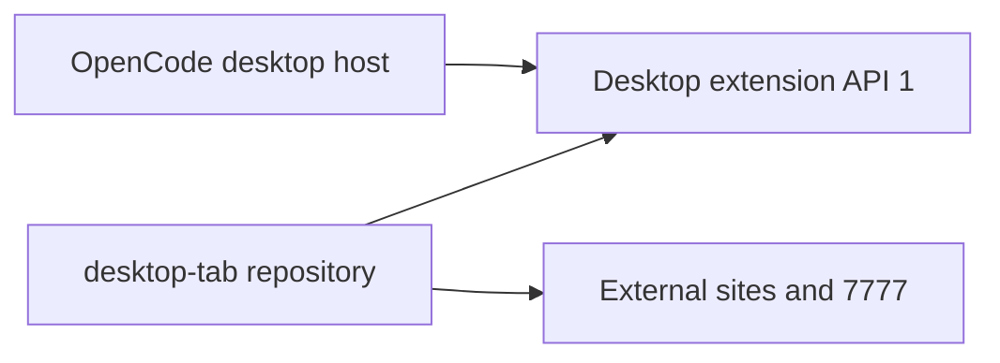

# Desktop Tab

The optional SigmaAgents desktop shell for OpenCode 2.0.3 and later hosts implementing desktop extension API 1. This is a separate Git repository checked out beside `packages/desktop`, like `packages/7777`. It is an Electron desktop extension, not a server/tool plugin.

## Ownership



OpenCode owns application lifecycle, managed service discovery, native menus, the main renderer's RPC transport, window recovery, appearance, and SQLite. Desktop Tab owns configuration, sidebar UI, tab view lifetimes, site navigation/permissions, encrypted cookie snapshots, THAPE SSO, and external-site preload APIs. Only `@opencode/desktop/extension` is imported from desktop, and it is a **type-only public contract**. There are no imports from desktop, app, core, or server internals.

Its `environment` hook selects the bundled `thape-config` directory for packaged builds and as the development fallback; an explicit development `OPENCODE_CONFIG_DIR` still wins. Its `beforeQuit` hook requests a service stop when exiting through the account dialog. These hooks are optional additions to host API 1 and require a host implementing them.

The implementation replaces the window-manager fork from `0ac1b09201^..089e35941c` with a small host adapter and a per-window tab controller. Updating sites, sidebar controls, SSO endpoints, or tab lifecycle no longer requires modifying OpenCode's window creation or IPC implementation.

## Develop and build

Place this checkout at `packages/desktop-tab` and the existing 7777 checkout at `packages/7777`. Run `bun install` from the OpenCode workspace to link the host peer dependency and install this package's dependencies. The host package provides Electron and the public extension types; they are not a second copy of desktop.

From this directory:

```sh
bun dev
bun run build
bun typecheck
bun test
bun run test:electron
```

`bun dev` starts the existing desktop development workflow with this extension selected. It accepts the desktop script's server options. `bun run build` first builds 7777, then runs desktop's normal prebuild/build with the extension selected. Packaged assets and preloads are copied into desktop's `out` directory and included by the existing Electron packager; the source checkout is not needed at runtime.

To start development directly from `packages/desktop`:

```sh
OPENCODE_DESKTOP_EXTENSION=../desktop-tab bun run dev
```

The host's `dev` command rebuilds from source and defaults to the base desktop when the extension is not selected. A previous extension-enabled build does not change that default. An environment variable prefixed to one command applies only to that command; use the prefix again for each host command, or use this package's `dev` and `build` scripts to select the extension automatically.

To build and package for macOS from `packages/desktop`, after preparing the sibling 7777 renderer with `bun run build` in `packages/7777`:

```sh
OPENCODE_DESKTOP_EXTENSION=../desktop-tab bun run build
OPENCODE_DESKTOP_EXTENSION=../desktop-tab bun run package:mac
```

After `bun run build` from this package, you can go directly to the host packaging command above. Keep the same prefix with `package`, `package:win`, or `package:linux`. Packaging consumes desktop's current `out` directory without rebuilding it; setting the variable only at packaging time cannot add the extension to a base desktop build.

For an already prepared sidecar and 7777 bundle, use `OPENCODE_DESKTOP_EXTENSION=../desktop-tab bunx --no-install electron-vite build` to rebuild only Electron assets. To build the base desktop without this checkout, use `OPENCODE_DESKTOP_EXTENSION=none bun run build` from desktop. Set the extension environment variable in your distribution CI for the host build and packaging commands; desktop defaults to no extension.

`desktop-extension.json` declares the main, preload, renderer, and asset entry points. Its `7777` asset points at the sibling renderer build. A distribution without a bundled 7777 tab can remove that asset entry. `ELECTRON_7777_RENDERER_URL` still selects its development server; otherwise bundled HTML is used.

## Compatibility

Existing `OPENCODE_CONFIG_DIR/sigmaagents.jsonc` files work unchanged. Each `desktopTabs` entry retains `id`, `title`, `label`, `skipDisplay`, `releaseWhenLostFocus`, `systemControlColor`, `html`, `devHtml`, `url`, `partition`, `localServer`, `localAgent`, `welcomeText`, and `suggestedQuestions`. The hidden `opencode` tab remains available to settings and sign-in actions. Views are created lazily, retained by default, released when configured, and closed when their window closes.

Back, forward, reload, and recent URL history operate on the active content. The base desktop owns these generic commands so native menus work with or without the extension. Configured origins and the exact THAPE SSO origin remain embedded; other navigation and popups open externally. Local-network and clipboard permissions stay limited to registered `localServer` views at their configured origins, including when multiple windows share a partition.

External pages retain `window.api.awaitInitialization()` and `window.api.getCybrosCurrentUser()`. Initialization preserves site metadata and SSO data; the local service password is supplied only to tabs configured with `localServer: true`. Calls are checked against the registered top-level web contents and the configured origin. Bundled 7777 renderers retain the `AppGetCybrosCurrentUser` RPC name through a small compatibility forwarder in the host. The implementation and network request live here.

Cookie snapshots migrate from the previous encrypted electron-store file and all new snapshots use host SQLite. Tab URL namespaces retain their names; desktop's existing legacy-state migration imports them. The saved `.thape-sso-bearer-api-key` file and its precedence over environment values are retained because SSO initialization happens before the host storage service starts. Successful sign-in still offers exit, which stops the background service before quitting; rejected credentials clear the saved key and restore the sign-in action. Reconnecting a service stream does not rewrite service CORS or restart the service.

## Repository and release workflow

This checkout is ignored by the parent repository. Configure its Git remote when the new repository is created; no remote URL is assumed. Commit and release extension changes here. Commit host API changes and its workspace lockfile in OpenCode. Keep API 1 backward compatible or introduce a new version deliberately. The host rejects unsupported runtime and manifest versions before loading windows.

Tests cover configuration, view lifetimes, site policy, SSO behavior, and actual sandboxed Electron IPC with temporary profiles and local fixture sites. The Electron smoke test never uses the installed desktop profile or the live background service. Its rejected-sender and rejected-origin log messages are expected assertions. Live THAPE account authentication and Windows/Linux native window behavior still need release QA.
