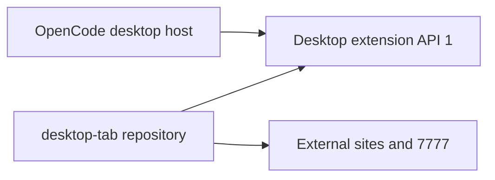

# Desktop Tab

The optional SigmaAgents desktop shell for OpenCode 2.0.3 and later hosts implementing desktop extension API 1. This is a separate Git repository checked out beside `packages/desktop`, like `packages/7777`. It is an Electron desktop extension, not a server/tool plugin.

## Ownership


```mermaid
flowchart LR
  Desktop[OpenCode desktop host] --> Contract[Desktop extension API 1]
  Tabs[desktop-tab repository] --> Contract
  Tabs --> Sites[External sites and 7777]
```

OpenCode owns application lifecycle, managed service discovery, native menus, the main renderer's RPC transport, window recovery, appearance, and SQLite. Desktop Tab owns configuration, sidebar UI, tab view lifetimes, site navigation/permissions, encrypted cookie snapshots, THAPE SSO, and external-site preload APIs. Only `@opencode/desktop/extension` is imported from desktop, and it is a **type-only public contract**. There are no imports from desktop, app, core, or server internals.

Its `environment` hook sets `OPENCODE_CONFIG_DIR` to the resources `thape-config` directory in packaged builds and as the development fallback; an explicit development `OPENCODE_CONFIG_DIR` still wins. Both desktop tabs and the server use that directory, and server settings changes write there. The server loads well-known defaults, standard user configuration, the selected global directory, and project configuration in increasing priority. Its `beforeQuit` hook requests a service stop when exiting through the account dialog. These hooks are optional additions to host API 1 and require a host implementing them.

The implementation replaces the window-manager fork from `0ac1b09201^..089e35941c` with a small host adapter and a per-window tab controller. Updating sites, sidebar controls, SSO endpoints, or tab lifecycle no longer requires modifying OpenCode's window creation or IPC implementation.

## Develop and build

Place this checkout at `packages/desktop-tab` with renderer checkouts at `packages/7777` and `packages/plm-meeting`. Run `bun install` from the OpenCode workspace to link the host peer dependency and install this package's dependencies. The host package provides Electron and the public extension types; they are not a second copy of desktop.

From this directory:

```sh
bun dev
bun run build
bun typecheck
bun test
bun run test:electron
```

`bun dev` starts the existing desktop development workflow with this extension selected. It accepts the desktop script's server options. `bun run build` delegates to desktop's normal prebuild/build with the extension selected. The host prebuild runs each project/script pair in the manifest's `builds` map in order (currently `plm-meeting` → `build:shared`) exactly once, including when invoked directly from `packages/desktop`. It rebuilds missing or stale shared output before compiling Electron. A failed step stops the build. Packaged assets and preloads are copied into desktop's `out` directory and included by the existing Electron packager; the source checkout is not needed at runtime.

To start development directly from `packages/desktop`:

```sh
OPENCODE_DESKTOP_EXTENSION=../desktop-tab bun run dev
```

The host's `dev` command rebuilds from source and defaults to the base desktop when the extension is not selected. A previous extension-enabled build does not change that default. An environment variable prefixed to one command applies only to that command; use the prefix again for each host command, or use this package's `dev` and `build` scripts to select the extension automatically.

To build and package for macOS from `packages/desktop`:

```sh
OPENCODE_DESKTOP_EXTENSION=../desktop-tab bun run build
OPENCODE_DESKTOP_EXTENSION=../desktop-tab bun run package:mac
```

After `bun run build` from this package, you can go directly to the host packaging command above. Keep the same prefix with `package`, `package:win`, or `package:linux`. Packaging consumes desktop's current `out` directory without rebuilding it; setting the variable only at packaging time cannot add the extension to a base desktop build.

If `OPENCODE_DESKTOP_EXTENSION` is already exported to this checkout's absolute path, no per-command prefix or
separate agent build is needed. From `packages/desktop`, the Windows x64 release commands remain:

```sh
RUST_TARGET=x86_64-pc-windows-msvc bun run build && \
RUST_TARGET=x86_64-pc-windows-msvc bun run package:win -- --x64 --publish never
```

For an already prepared sidecar and both renderer bundles, use `OPENCODE_DESKTOP_EXTENSION=../desktop-tab bunx --no-install electron-vite build` to rebuild only Electron assets. To build the base desktop without this checkout, use `OPENCODE_DESKTOP_EXTENSION=none bun run build` from desktop. Set the extension environment variable in your distribution CI for the host build and packaging commands; desktop defaults to no extension.

`desktop-extension.json` declares the main, preload, renderer, and asset entry points. Its `sigma-agents` asset points at `../plm-meeting/dist-shared/sigma-agents`, built once with both branch entry points. Its `assets` mapping merges `../plm-meeting/dist-shared/assets` into the desktop renderer's asset directory; identical content-hashed files share one packaged copy, and differing contents at the same path fail the build. The host supplies the common root favicons. The host's prebuild and development preparation read its `builds` map; the API 1 host continues to consume the existing entry points and `assets` map. A distribution without bundled local agents can remove both shared asset mappings and the build entry. `ELECTRON_7777_RENDERER_URL` still selects its development server; otherwise bundled HTML is used.

## Configuring web and local agents

Tabs are validated and normalized once in `src/main/desktop-tabs.ts` into three types. `type` is optional in JSONC, so existing configurations need no migration:

| Type      | Source                                          | Loading                                                                              |
| --------- | ----------------------------------------------- | ------------------------------------------------------------------------------------ |
| `primary` | Reserved `id: "opencode"`                       | Host's main renderer; always available for settings and sign-in                      |
| `web`     | `url` and `partition`                           | External view with the narrow site preload and existing navigation/permission policy |
| `local`   | `html`, optionally `devHtml` and `devServerEnv` | Bundled renderer created through the host's trusted renderer API                     |

Without `type`, `opencode` selects the primary renderer, `url` selects a web tab, and `html` selects a local tab. Unknown types, incomplete sources, and mixed web/local source fields are rejected with the config filename and entry index. `localServer` belongs to web tabs: it enables their existing local-service access and does not change the tab's type.

`id` identifies the tab and its view lifetime. `localAgent` selects the agent supplied to that view; it need not match the tab ID or the renderer asset directory. All three types support `localAgent`, `welcomeText`, `suggestedQuestions`, and `storageKeys`. Multiple local agents can reuse the same `html` bundle with different IDs and initialization data. `skipDisplay`, `releaseWhenLostFocus`, and `systemControlColor` retain their existing behavior.

For example, future entries can be added to `desktopTabs` without changing the controller, IPC, or window creation code:

```jsonc
{
  "id": "web-agent",
  "type": "web",
  "title": "Web agent",
  "label": "Web",
  "url": "https://example.com/agent",
  "partition": "persist:desktop-tab-web-agent",
  "localServer": true,
  "localAgent": "web-agent",
},
{
  "id": "local-agent",
  "type": "local",
  "title": "Local agent",
  "label": "Local",
  "html": "sigma-agents/7777.html",
  "devHtml": "index.html",
  "localAgent": "local-agent",
  "storageKeys": {
    "sessionID": "opencode.local-agent.session.id",
    "sessionDirectory": "opencode.local-agent.session.directory",
    "promptDraft": "opencode.local-agent.prompt.draft"
  },
  "welcomeText": "Welcome",
  "suggestedQuestions": ["How can you help?"],
}
```

These are examples only; the corresponding server agent must also exist. Reusing a renderer requires that renderer to support the requested agent through its initialization data.

`storageKeys` configures the 7777-style renderer's localStorage entries for its current session ID, session directory, and composer draft. When supplied, all three values must be nonempty strings. Give independent agents different keys even when they share the same HTML bundle. The values are sent unchanged through both bundled-renderer initialization and the external-site preload; other renderers may choose whether to use them.

The existing 7777 tab uses `opencode.7777.session.id`, `opencode.7777.session.directory`, and `opencode.7777.prompt.draft`, preserving saved data. Older configurations without `storageKeys` and standalone 7777 deployments retain those defaults. Changing a key selects a different storage entry; it does not migrate or delete the previous entry. Model and UI preferences and accepted-prompt history remain separate from these three keys.

Each local tab uses `ELECTRON_<TAB_ID>_RENDERER_URL` for its optional development server. The ID is uppercased and non-alphanumeric characters become underscores: `local-agent` uses `ELECTRON_LOCAL_AGENT_RENDERER_URL`. Set `devServerEnv` to a different environment variable name to share a server or override this convention. For example, a tab reusing 7777 can set `"devServerEnv": "ELECTRON_7777_RENDERER_URL"`. An unset or blank variable selects bundled HTML; local tabs never inherit the host's primary development server or another tab's server implicitly. `devHtml` is the entry path relative to the selected development server.

For an unrelated renderer that cannot join the shared SigmaAgents build, add its build and packaged asset mapping to `desktop-extension.json` alongside the existing entries:

```json
{
  "builds": { "../my-renderer": "build" },
  "assets": { "my-renderer": "../my-renderer/dist" }
}
```

Paths are relative to this extension checkout; each `builds` value names that project's package script. Point the tab's `html` at `my-renderer/index.html`. A second agent that reuses an existing bundle needs only its tab configuration, with no additional build entry. Web tabs need no renderer build or packaged asset entry.

The distribution's `7777` and `plm-meeting` tabs retain the source code from their respective branches, compiled
in one Vite build. Keep the `../plm-meeting` → `build:shared` build entry and both the `sigma-agents` and `assets` mappings.
The tab configuration loads `sigma-agents/7777.html` and `sigma-agents/plm-meeting.html`. Shared libraries, fonts,
and other identical assets are emitted once. Fonts, images, and WASM shared with the desktop renderer also use
the common `assets/` directory. Release the updated `thape-config` with the executable so both tab
paths match the packaged entries. Each checkout can still build its standalone `dist/index.html` independently.
Use `ELECTRON_7777_RENDERER_URL=http://localhost:4777/` and
`ELECTRON_PLM_MEETING_RENDERER_URL=http://localhost:4778/` for independent hot reload. Agent identity and
session/draft keys are still supplied separately for each tab.

## Adding another Sigma agent

If the new agent can reuse an existing UI, add a `desktopTabs` entry in
`packages/desktop/resources/thape-config/sigmaagents.jsonc` that loads `sigma-agents/7777.html` (or the meeting UI).
Give it a unique `id`, `localAgent`, and all three `storageKeys`; add its server profile under `thape-config/agents/`.
No renderer checkout, shared build entry, or extra asset copy is needed for this case.

For an agent with a different UI branch:

1. Create a sibling checkout such as `packages/my-agent`, give its package a unique workspace name, and run
   `bun install` from the workspace root. It must provide the shared builder's expected `index.html`,
   `src/entry.tsx`, `public/`, and `public/oc-theme-preload.js` layout. Keep its standalone `dist/` independent.
2. Add its directory name to the `renderers` list in `packages/plm-meeting/scripts/build-shared.ts`, for example
   `["7777", "plm-meeting", "my-agent"]`. The directory name becomes `sigma-agents/my-agent.html`. The shared build
   resolves `@/` imports against their source checkout and compiles all entries together so dependencies can be shared.
   It uses `plm-meeting/vite.config.ts`; integrate any new Vite plugin or worker requirements there rather than
   assuming the new checkout's own Vite config will be loaded.
3. Keep the one `../plm-meeting` → `build:shared` manifest build and the existing `sigma-agents` and `assets` mappings.
   Do not add `my-agent/dist` as another packaged directory. All compiled chunks, fonts, images, workers, and WASM
   belong in the common `assets/` output. Public files with the same path must have identical contents; namespace
   agent-specific public files. New public files also need an appropriate manifest mapping into the desktop renderer,
   or should be imported from source so Vite emits them into `assets/`. The host already supplies the common favicons.
4. Add the tab to `thape-config/sigmaagents.jsonc` with `"type": "local"`, `"html": "sigma-agents/my-agent.html"`,
   `"devHtml": "index.html"`, a unique `id`/`localAgent`, and unique session, directory, and draft storage keys.
   Add `thape-config/agents/my-agent.md`. For hot reload, use the new checkout's own port and
   `ELECTRON_MY_AGENT_RENDERER_URL` (or configure `devServerEnv`).
5. Extend the shared-build fixture coverage for the new entry and check its branch-specific UI and lazy imports.
   Run the new renderer's tests/typecheck, the shared-build tests, and the desktop build with this extension exported.
   Verify every `sigma-agents/*.html` page loads from the packaged app, including Office previews, fonts, and workers
   used by that agent. The host build rejects same-path assets with different contents rather than overwriting them.
6. Release the renderer branches, desktop-tab manifest, desktop changes, and updated `thape-config` together.
   Ensure build machines have every listed checkout before running the normal desktop build and packaging commands.

`bun run build` from `packages/desktop` now performs the shared build automatically whenever this extension is
selected. `bun run build:shared` from `packages/plm-meeting` remains available for focused renderer iteration.

## Compatibility

Existing `OPENCODE_CONFIG_DIR/sigmaagents.jsonc` files work unchanged. Each `desktopTabs` entry retains `id`, `title`, `label`, `skipDisplay`, `releaseWhenLostFocus`, `systemControlColor`, `html`, `devHtml`, `url`, `partition`, `localServer`, `localAgent`, `welcomeText`, and `suggestedQuestions`. The hidden `opencode` tab remains available to settings and sign-in actions. Views are created lazily, retained by default, released when configured, and closed when their window closes.

Back, forward, reload, and recent URL history operate on the active content. The base desktop owns these generic commands so native menus work with or without the extension. Configured origins and the exact THAPE SSO origin remain embedded; other navigation and popups open externally. Local-network and clipboard permissions stay limited to registered `localServer` views at their configured origins, including when multiple windows share a partition.

The primary renderer and browser embeds share a plain Electron `View` container. Embeds are siblings above the renderer: children of a `WebContentsView` sit beneath its own page. The container follows the primary tab's bounds and visibility.

External pages retain `window.api.awaitInitialization()` and `window.api.getCybrosCurrentUser()`. Initialization preserves site metadata and SSO data; the local service password is supplied only to tabs configured with `localServer: true`. Calls are checked against the registered top-level web contents and the configured origin. Bundled 7777 renderers retain the `AppGetCybrosCurrentUser` RPC name through a small compatibility forwarder in the host. The implementation and network request live here.

Cookie snapshots migrate from the previous encrypted electron-store file and all new snapshots use host SQLite. Tab URL namespaces retain their names; desktop's existing legacy-state migration imports them. The saved `.thape-sso-bearer-api-key` file and its precedence over environment values are retained because SSO initialization happens before the host storage service starts. Successful sign-in still offers exit, which stops the background service before quitting; rejected credentials clear the saved key and restore the sign-in action. Reconnecting a service stream does not rewrite service CORS or restart the service.

## Repository and release workflow

This checkout is ignored by the parent repository. Configure its Git remote when the new repository is created; no remote URL is assumed. Commit and release extension changes here. Commit host API changes and its workspace lockfile in OpenCode. Keep API 1 backward compatible or introduce a new version deliberately. The host rejects unsupported runtime and manifest versions before loading windows.

Tests cover configuration, view lifetimes, site policy, SSO behavior, and actual sandboxed Electron IPC with temporary profiles and local fixture sites. The Electron smoke test never uses the installed desktop profile or the live background service. Its rejected-sender and rejected-origin log messages are expected assertions. Live THAPE account authentication and Windows/Linux native window behavior still need release QA.
